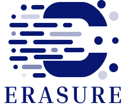

# ERASURE - Redefining Privacy Through Selective Machine Unlearning




## Table of Contents
* [General Information](#general-information)
* [Team Information](#team-information)
* [First steps with ERASURE](#first-steps-with-erasure)
* [Resources Provided with the Framework](#resources-provided-with-the-framework)
* [References](#references)

## General Information
The challenge of ensuring privacy and compliance in machine learning models, such as those used in recommendation systems, healthcare, and financial forecasting, is exacerbated by the difficulty of removing specific data from trained models. Machine Unlearning (MU) techniques aim to address this by providing methods to selectively erase data from models, enhancing privacy, trustworthiness, and adaptability. However, the current landscape of MU research is fragmented, with inconsistencies in definitions, methodologies, datasets, and evaluation protocols. 

To tackle these challenges, we introduce ERASURE, a research framework designed to facilitate the research process of machine unlearning, focusing on efficiently and securely removing specific data or knowledge from machine learning models. This framework addresses privacy and compliance concerns by providing a way to systematically evaluate algorithms and methodologies that allow for the selective "erasure" of data, ensuring that the information has no residual influence on model predictions once removed.

ERASURE offers fully extensible built-in components, allowing users to define custom unlearning techniques, integrate custom and synthetic datasets, implement tailored evaluation metrics, and meld seamlessly with state-of-the-art machine learning models.
Additionally, it provides a flexible environment for defining and running unlearning experiments, enabling researchers to evaluate the effectiveness and efficiency of various unlearning methods systematically.


## Team Information:
* Prof. Giovanni Stilo, PhD. [project leader/research advisor]
* Flavio Giobergia, PhD. [research advisor]
* Andrea D'Angelo [investigator]
* Claudio Savelli [investigator]
* Gabriele Tagliente [pivotal contributor]

## First steps with ERASURE
```console
foo@bar:~$ python main.py configs/proof_of_concept.jsonc
```


## Resources Provided with the Framework


### Datasets:

You can quickly implement any Dataset you like in ERASURE. At the moment, ERASURE has built-in DataSource classes for the following sources:


### Unlearners: 

Developing your own custom Unlearner in ERASURE is easy. 

However, benchmarking your Unlearner in an unified environment is just as important. Right now, ERASURE comes built-in with the following Unlearners:


 


 


## References

<!--  taken with Harvard reference style -->

1. **cfk, euk**: Shashwat Goel, Ameya Prabhu, Amartya Sanyal, Ser-Nam Lim, Philip Torr, and Ponnurangam Kumaraguru. 2022. Towards adversarial evaluations for inexact machine unlearning. arXiv preprint arXiv:2201.06640 (2022).

2. **NegGrad, Fisher Forgetting**: Golatkar, A., Achille, A. and Soatto, S., 2019. Eternal sunshine of the spotless net: Selective forgetting in deep networks. In 2020 IEEE. In CVF Conference on Computer Vision and Pattern Recognition (CVPR) (pp. 9301-9309).

3. **Advanced NegGrad**: Choi, D. and Na, D., 2023. Towards machine unlearning benchmarks: Forgetting the personal identities in facial recognition systems. arXiv preprint arXiv:2311.02240.

4. **UNSIR**: Tarun, A.K., Chundawat, V.S., Mandal, M. and Kankanhalli, M., 2023. Fast yet effective machine unlearning. IEEE Transactions on Neural Networks and Learning Systems.

5. **Bad Teaching**: Chundawat, V.S., Tarun, A.K., Mandal, M. and Kankanhalli, M., 2023, June. Can bad teaching induce forgetting? unlearning in deep networks using an incompetent teacher. In Proceedings of the AAAI Conference on Artificial Intelligence (Vol. 37, No. 6, pp. 7210-7217).

6. **SCRUB**: Kurmanji, M., Triantafillou, P., Hayes, J. and Triantafillou, E., 2024. Towards unbounded machine unlearning. Advances in neural information processing systems, 36.

7. **Selective Synaptic Dampening**: Foster, J., Schoepf, S. and Brintrup, A., 2024, March. Fast machine unlearning without retraining through selective synaptic dampening. In Proceedings of the AAAI Conference on Artificial Intelligence (Vol. 38, No. 11, pp. 12043-12051).

8. **SalUn**: Fan, C., Liu, J., Zhang, Y., Wong, E., Wei, D. and Liu, S. (2024) ‘SalUn: Empowering machine unlearning via gradient-based weight saliency in both image classification and generation’, arXiv preprint, arXiv:2310.12508. Available at: https://arxiv.org/abs/2310.12508.